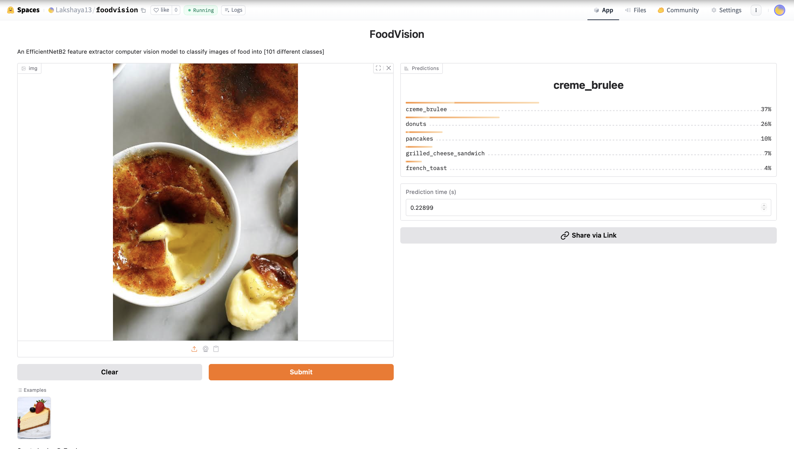

# 🍕 Food Vision - Image Classification using EfficientNetB2
## Preview
  <!-- replace with your actual file name -->
DEPLOYED AT :- [https://huggingface.co/spaces/Lakshaya13/foodvision]
This project focuses on classifying food images using transfer learning with **EfficientNetB2** and the **Food-101** dataset. It leverages PyTorch and torchvision to train a deep learning model for multi-class image classification.

## 📁 Dataset

We use the [Food-101 dataset](https://data.vision.ee.ethz.ch/cvl/datasets_extra/food-101/) which contains 101 food categories with 101,000 images. The dataset is restructured into `train/` and `test/` directories using custom preprocessing scripts.

## 🚀 Features

- ✅ Automatic dataset extraction and organization
- ✅ Modular PyTorch training and evaluation pipeline
- ✅ EfficientNetB2 feature extractor
- ✅ Transfer learning with frozen base layers
- ✅ Training metrics visualization
- ✅ Final model saving for deployment

## 🧠 Model

- Backbone: `EfficientNetB2` (pretrained on ImageNet)
- Final classifier modified to match 101 food classes
- Final test accuracy: **~63.64%**
- Total Parameters: **7.8M**
- Model Size: **~30 MB**

## 🛠️ Setup

### Requirements

- Python 3.8+
- torch >= 1.12
- torchvision >= 0.13
- tqdm
- matplotlib
- numpy

